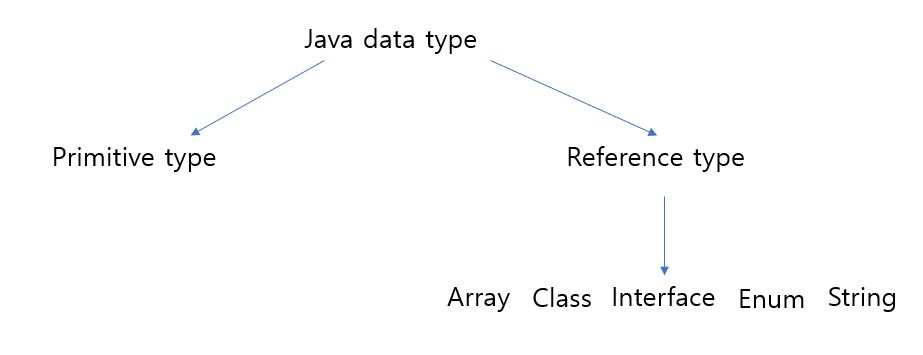

* 프리미티브 타입 종류와 값의 범위 그리고 기본 값
* 프리미티브 타입과 레퍼런스 타입
* 리터럴
* 변수 선언 및 초기화하는 방법
* 변수의 스코프와 라이프타임
* 타입 변환, 캐스팅 그리고 타입 프로모션
* 1차 및 2차 배열 선언하기
* 타입 추론, var

## 프리미티브 타입 종류와 값의 범위 그리고 기본 값
|타입|종류|기본값|크기|범위|
|--------|-------|--------|-------|--------|
|boolean|true or false|false|1 bit|NA|
|char|Unicode char|\u0000|16 bits|\u0000 to \uFFFF|
|byte|Signed integer|0|8 bits|-128 to 127|
|short|Signed integer|0|16 bits|-32678 to 32767|
|int|Signed integer|0|32 bits|-2147483648 to 2147483647|
|long|Signed integer|0|64 bits|-9223372036854775808 to 9223372036854775807|
|float|IEEE 754 floating point|0.0|32 bits|1.4E-45 to 3.4028235E+38|
|double|IEEE 754 floating point|0.0|64 bits|4.9E-324 to 1.797E+308|

## 프리미티브 타입과 레퍼런스 타입
</img><br/>
프리미티브 타입 8개는 자바에서 직접 정의된 타입이다. 따라서 우리가 임의로 새로운 프리미티브 타입을 정의할 수 없다.
반면에 레퍼런스 타입은 유저가 정의할 수 있다. 따라서 무한한 개수가 존재한다.
프리미티브 타입은 하나의 값만을 나타낸다면 레퍼런스 타입은 0개 이상의 프리미티브 값 혹은 객체를 가질 수 있다.
프리미티브 타입은 1~8 바이트의 용량만을 필요로 하지만 레퍼런스 타입은 상당한 용량을 필요로 한다.
레퍼런스 타입은 힙에 저장이 되고 필요가 없을 때 garbage collected되어 사라진다

## 리터럴
Literals are sequences of source characters that directly represent constant values that appear as is in Java source code.
말 그대로 자바 소스 코드에 나오는 값들이 리터럴이 된다 정수, 실수, 한 글자 부터 스트링 그리고 true false null 등이 포함된다
<br/>ex) 1 1.0 '1' 1L "one" true false null<br/>
리터럴 자체가 고정적인 값이기에 레퍼런스 타입은 리터럴이 될 수 없다
프리미티브 타입이 주로 리터럴이 되는데 스트링은 레퍼런스 타입이지만 특이하게 리터럴이 된다
자바의 스트링은 독특한 특성들을 가지고 있다

## 변수 선언 및 초기화하는 방법
변수 선언은 타입과 변수이름의 조합으로 선언된다
```
int a; // 타입 + 변수이름
```
변수가 선언됐을 때 기본 값을 가지지만 다음과 같이 초기화를 할 수 있다 
```
int a = 10;
```
다음과 같이 값을 직접 지정하는 것을 명시적 초기화라 한다

## 변수의 스코프와 라이프타임
로컬 변수는 변수가 정의된 메소드 혹은 코드블락에서만 사용될 수 있다
```java
void method() { // A method definition
  int i = 0; // Declare variable i
  while (i < 10) { // i is in scope here
    int j = 0; // Declare j; the scope of j begins here
    i++; // i is in scope here; increment it
  } // j is no longer in scope;
  System.out.println(i); // i is still in scope here
} // The scope of i ends here
```
스코프 바깥에서 로컬변수는 접근될 수 없다.
흔히 lexical scoping이라 불리는 방식으로 { } 사이에 정의된 로컬 변수들은 { } 사이에서만 사용된다
람다 표현식의 경우 독특하게 lexical scoping에 적용되지 않고 captured variable이라 불리는 변수들이 생겨서 { } 밖에서도 접근이 가능하다

## 타입 변환, 캐스팅 그리고 타입 프로모션
primitive type간에 타입 변환은 가능하다
크기가 작은 type에서 크기가 큰 type으로는 손실 없이 변환되나 크키가 큰 type에서 크기가 작은 type으로의 변환은 손실이 발생할 수 있다
reference type간에 타입 변환은 상속이 되었을 때만 가능하다
캐스팅이란 명시적으로 타입 변환을 해주는 것이다

## 1차 및 2차 배열 선언하기
```
int[] onedim;
int[][] twodim;
```

## 타입 추론, var
타입 추론이란 변수의 타입을 명시적으로 적지 않아도, 컴파일러가 타입을 추론하는 것을 말한다
var을 사용하게 되면 컴파일러가 초기화 된 리터럴을 바탕으로 타입을 추론한다
```
var tt = "hi" // var -> string
```
var은 반드시 초기화를 하여 사용해야 한다. 단순히 선언만 하는것으로는 작동하지 않는다
