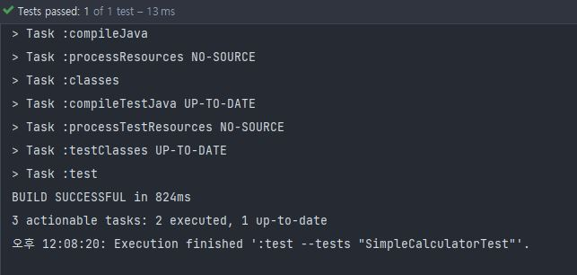
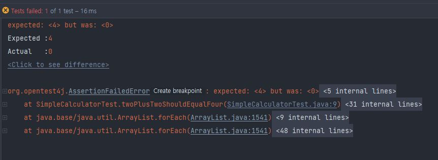

## unit test
하나의 개별의 코드 혹은 유닛을 스스로 테스트 하는것
<br/> 클래스 혹은 클래스 안의 메소드가 제대로 작동하는지 테스트하는 것

## junit 설치
dependency 추가로 쉽게 설치 가능
<br/> 인텔리제이에서 해당 클래스 혹은 메소드에서 컨트롤+쉬프트+t 누르면 테스트 관련 메뉴 열림
<br/> 생성하게 되면 src/test/ 경로로 생성

## test 방법
test경로에 만들어진 파일에서 @Test annotation을 붙이고 코드를 작성한다
```
class SimpleCalculatorTest {
    @Test
    void twoPlusTwoShouldEqualFour() {
        SimpleCalculator calculator = new SimpleCalculator();
        assertEquals(4,calculator.add(2,2));
    }
}
```
```
public class SimpleCalculator {
    public int add(int numberA, int numberB) {
        return numberA + numberB;
    }
}
```
다음과 같이 simplecalculator이라는 클래스에서 add라는 메소드를 만들었을 때 작동하는지를 테스트를 하기 위해
<br/> twoplustwoshouldequalfour이라는 test를 만들었다
<br/> test의 경우 assert로 테스트를 하게 되는데 assertEquals의 경우에는 1번째 parameter가 정상적으로 출력됐을 때 나와야 하는 값
<br/> 2번째 parameter가 테스트케이스가 들어가게 된다
</img><br/>
</img><br/>
